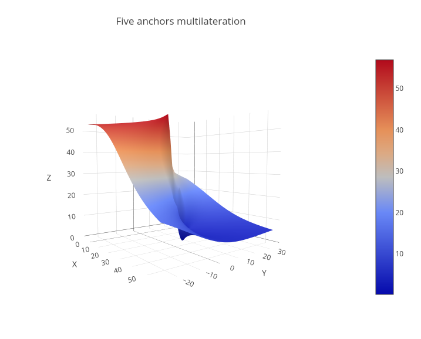

This is simple quick-and-dirty Javascript 3D function plotter written originally
for documentation purposes of multilateration function minimizer.

Released under MIT license, but be aware of licenses of other libraries used.

[Link to the site](https://dalibor-drgon.github.io/3d-plotter/)

